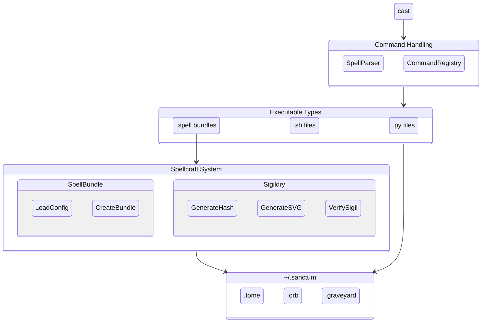

# Magi CLI: An Arcane Command Line Interface


> "Any sufficiently advanced technology is indistinguishable from magic."  
> *― Arthur C. Clarke*

Embrace the arcane with Magi CLI, a spellcasting-inspired command line interface (CLI) tool that fuses the mystical arts with practical utility. Unravel the secrets of the cosmos and command your operating system with the wisdom of the ancient magi.

## Overview

Magi CLI is forged in Python, channeling the enigmatic power of the Click library. It offers an array of spells (commands) that manipulate the filesystem, manage files, and automate tasks. Designed to be extendable, Magi CLI allows you to add new spells as your knowledge of the hidden arts expands. While platform agnostic, it performs best with a bash terminal like Git Bash.

## Core Features

### The Sanctum (~/.sanctum)
Your magical workspace contains:
- `.tome/`: Storage for spell bundles
- `.orb/`: Local spell cache
- `.graveyard/`: Temporary storage for deleted files
- `.runes/`: GUI elements for spell execution

### Cast Command
The root command serving as the universal execution command. It displays all available spells and `.spell` files in your tome when run without arguments. Currently supports:
- Python scripts (.py)
- Shell scripts (.sh)
- Spell bundles (.spell)

## Spell Design Tenets

- **Effectiveness**: Spells must work reliably. Half-functioning spells won't be included in release versions.
- **Flavorfulness**: Spells should feel magical, requiring only essential memorization unless additional features can be added in a thematic way.
- **Modularity**: Each spell must work both as `cast spell target` and as a standalone script (`python path/to/spell.py target`).
- **Innovation**: Spells should not duplicate standard UNIX commands. We're crafting new magic, not recreating existing tools.
- **Fun**: Keep the magical essence alive with thematic messages and interactions!

## Core Spells

### File Management
- **Fireball** (`fb`): Transmute a file or directory into ashes, sending it to the '.graveyard' realm
- **Banish** (`bn`): Move files to a temporary exile realm
- **Divine** (`dv`): Display detailed file/directory information

### System Operations
- **Necromancy** (`nc`): Initialize the .graveyard for file preservation
- **Raise_Dead** (`rd`): Restore files from the .graveyard

### Spell Management
- **Spellcraft** (`sc`): Create new spells and spell bundles
- **Ponder** (`pd`): Explore and manage available spells. Connect to the Chamber for additional community spells.

Additional spells are available through the Magi Chamber (`magi-chamber.fly.dev`), accessible via the `ponder` spell.

## Spellcraft Guide

Spellcraft (`sc`) is a powerful tool for creating new spells. It supports three main types of spell creation:

### 1. Macro Spells
Create spells that combine multiple commands:
```bash
# Create a macro spell with 3 commands
cast sc 3 backup_spell
```
The wizard will prompt you for:
- Spell description
- Three commands to be executed in sequence

### 2. Script Spells
Convert existing Python or Shell scripts into spells:
```bash
# Create a spell from a Python script
cast sc path/to/script.py spell_name

# Create a spell from a Shell script
cast sc path/to/script.sh spell_name
```

### 3. Bundled Spells
Create complex spells with multiple files and resources using YAML configuration:

```yaml
# spell.yaml
name: my_spell
description: A powerful new spell
type: bundled
shell_type: python
entry_point: spell/main.py
dependencies:
  python:
    - requests>=2.0.0

code: |
  import click
  
  @click.command()
  def main():
      """Your spell's magic here."""
      click.echo("Spell cast successfully!")

artifacts:
  - path: data/config.json
    content: |
      {
        "settings": "value"
      }
```

Create the bundled spell:
```bash
cast sc spell.yaml
```

## Installation

### From PyPI
```bash
pip install magi-cli-pypi
```

### From Source
```bash
git clone https://github.com/bobbyhiddn/Magi_CLI.git
cd Magi_CLI
pip install .
```

## Workflow of SpellCasting



## Security
- Spells are verified using sigils (cryptographic signatures)
- Dependencies are installed in isolated environments
- Spell bundles are checked for integrity before execution

## Contributing
See [CONTRIBUTING.md](CONTRIBUTING.md) for detailed guidelines.

## License
MIT License

## Acknowledgments
Created and maintained by Micah Longmire (@bobbyhiddn)